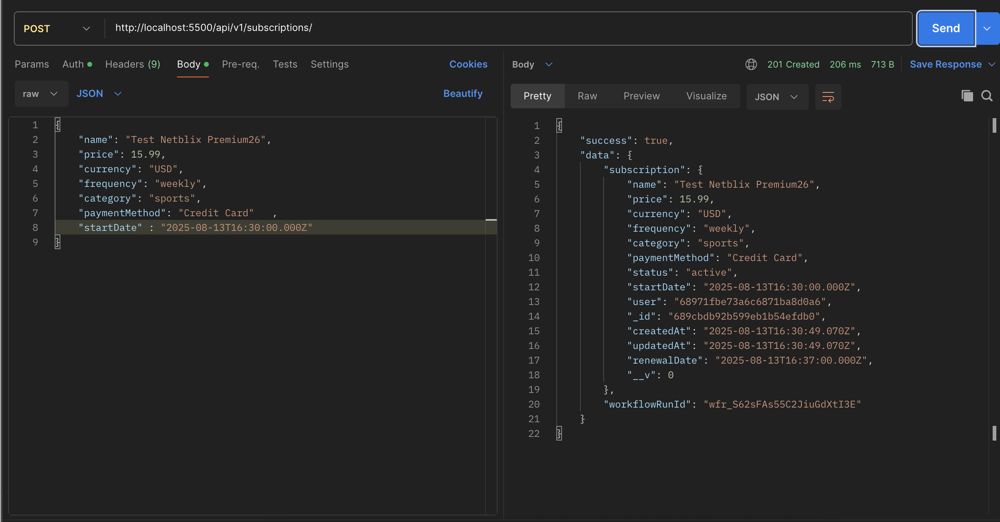
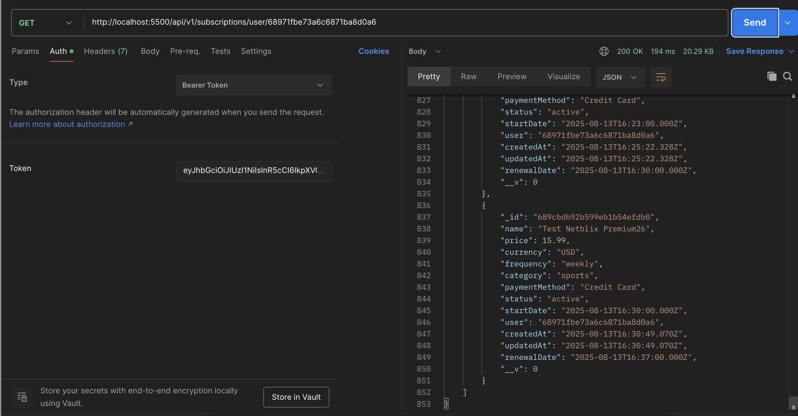

<h3 align="center">Subscription Tracker API</h3>

## ⚠️ Note

This project was implemented based on a tutorial video on YouTube from JS Mastery [Complete Backend Course | Build and Deploy Your First Production-Ready API](https://www.youtube.com/watch?v=rOpEN1JDaD0).

## Table of Contents

1. [Introduction](#introduction)
2. [Demo](#demo)
3. [Tech Stack](#tech-stack)
4. [Features](#features)
5. [Quick Start](#quick-start)
6. [What I learned](#learn)
7. [Implementation Notes](#note)
8. [Missing Features](#miss)

## <a name="introduction">Introduction</a>

The project idea is to create backend api for subscriptions service and every time when user create a subscription, it will make a workflow to send reminder email to user after certain days before subscription end date.

The reason I wanted to follow this tutorial is that I want to try to learn more about Express.js and MongoDB.

## <a name="demo">Demo</a>

### Auth

#### Sign up

<a href="">
  
</a>

#### Sign in

<a href="">
  
</a>

### Users

#### Get users

<a href="">
  
</a>

#### Get user by id

<a href="">
  
</a>

### Subscriptions

#### Create subscription

<a href="">
  
</a>

#### Get subscriptions by user id

<a href="">
  
</a>

## <a name="tech-stack">Tech Stack</a>

- Express - as a backend framework
- MongoDB Atlas - as a cloud MongoDB database service(free tier)
- Mongoose - as an Object Data Modeling (ODM) library for `MongoDB`. It's different from ORM (Object Relational Mapping) which is for `SQL database`. Purpose of ODM and ORM is to map the data structure between the database and the application. But on the different data structure.
- Arcjet - as a middleware for rate limiting, protect from bots and also protect from attacks

1. Server side(create subscription api)
1. Create new subscription in database and return `subscriptionId`
1. Call `workflowClient.trigger` with `callback url`(`${SERVER_URL}/subscription/reminder` endpoint) and `subscriptionId` as body to Workflow.
1. Workflow side
1. Create `new workflow run` and call `callback url`(`${SERVER_URL}/subscription/reminder` endpoint) with `context` which has `workflowRunId`, `subscriptionId`(in `requestPayload`) and a lot of other information.
1. Server side(subscription/reminder endpoint) (need to use `serve` function from `@upstash/workflow/express` to handle request)
1. Extract `subscriptionId` from `context.requestPayload`
1. call `fetchSubscription` function which will call `context.run` to get `subscription` data by `subscriptionId` from database
1. Check if `subscription` is `active` and `renewalDate` is not passed
1. If `subscription` is `active` and `renewalDate` is not passed, it will call `sendReminderEmail` function to send email to user

in `subscription/reminder` endpoint

- Upstash (workflow) - as a scheduling queue service, first you call trigger workflow with data(context) and callback url. Then it will call your backend based on callback url.Then your backend need to handle the workflow based on the data(context) that you sent.
- NPM Libraries
  - bcryptjs - as a password hashing tool
  - nodemailer - as an email sending tool( I use personal `gmail` to send email in this project)
  - validator - as a string validation tool which provide various validation methods for string input(I use it for email validation in this project)
  - dayjs - as a date and time library
  - cookie-parser - as a cookie parsing tool
  - nodemon - to restart the server automatically when a file is changed

## <a name="features">Features</a>

## <a name="quick-start">Quick Start</a>

Follow these steps to set up the project locally on your machine.

**Prerequisites**

- Git
- Node.js
- npm

**Cloning the Repository**

```bash
git clone https://github.com/bank8426/try-express-mongodb.git
cd try-express-mongodb
```

**Installation**

Install the project dependencies using npm:

```bash
npm install
```

**Set Up Environment Variables**

1. Create a new file named `.env.development.local` and copy content inside `.env.example`
2. Replace the placeholder values with your actual credentials

```env
# your base url
VITE_BASE_URL=http://localhost:5173

#https://www.syncfusion.com/
VITE_SYNCFUSION_LICENSE_KEY=

# https://cloud.appwrite.io/
VITE_APPWRITE_PROJECT_ID=
VITE_APPWRITE_API_KEY=
VITE_APPWRITE_DATABASE_ID=
# create users collection in database
VITE_APPWRITE_USERS_COLLECTION_ID=
# create trips collection in database
VITE_APPWRITE_TRIPS_COLLECTION_ID=
# it chage based on server region
VITE_APPWRITE_API_ENDPOINT=

# https://sentry.io/ for using with react-router
SENTRY_AUTH_TOKEN=

# https://aistudio.google.com/
GEMINI_API_KEY=

# https://unsplash.com/developers
UNSPLASH_ACCESS_KEY=

# https://dashboard.stripe.com/test/dashboard
STRIPE_SECRET_KEY=
```

**Running the Project**

You will need 2 terminals to run the project if you want to run qstash on local mode.

- First terminal to run qstash

```bash
npx @upstash/qstash-cli dev
```

<!-- https://upstash.com/docs/qstash/howto/local-tunnel -->

- Second terminal to run server

```bash
npm run dev
```

Your server will run on [http://localhost:5500](http://localhost:5500/)

## <a name="learn">What I learned</a>

- `Express.js`

  - `app.use()` is used to mount a middleware function which can use for something like parsing request body, parsing cookie in request header, call 3rd party middleware and also include `Router` when create nested routes
  - `app.get()/post()/put()/delete()` is used to handle HTTP request but it can add middleware function and chain it as well by adding it as parameter before last callback function.
    - Ex.
      ```js
      userRouter.get("/", authorize, getUsers);
      ```

- `Mongoose`

  - when handle create new data into database, you can use `pre` middleware with `save` as a first parameter(method name from Model class of Mongoose) to handle some logic before creating new data. But this can do after you created schema
    - Ex.
    ```js
      const yourSchema = new mongoose.Schema({ ... })
      yourSchema.pre("save", function (next) {
        ...
        next();
      })
      const YourModel = mongoose.model("YourModel", yourSchema)
    ```

- `arcjet` - there're many rate limiting algorithm that can be use. Token bucket
  is new to me. It use the idea that each request will consume a token(We can set the number of tokens that each request will consume) and if the token is not available, it will be blocked.

- `bcryptjs` can be used for creating salt that will mix with password before hash it to create hashed password that will be saved into database, and also use it to verify hashed password

- `jsonwebtoken` can be used for creating and verifying JSON Web Tokens (JWT) similor to `jose` library. But this is easier to use.

- `dayjs` is a date and time library that can be used for date comparison and format date and time. Ex. isBefore(), isAfter(), isSame() etc. But need to create dayjs instance first.

- `nodemailer` can be used for sending email by using your own gmail account for free. But also need to enable `2 step verification` in your gmail account and generate `app password` for it.

## <a name="note">Implementation Notes</a>

- MongoDB Atlas - everytime your IP address changed, you need to add it to the whitelist in the cloud mongodb. By go to https://cloud.mongodb.com/ and click on `Network Access` in `Security` section -> `Add IP Address` -> `Add Current IP Address`. Actually you can allow all IP address by click on `Add IP Address` -> `Allow Access from Anywhere`

- Workflow

  - Workflow method

    - `stepName` in this project we called it as `label` since we also use it to check `email template label` when sending email - But since propose of `stepName` is to track current step of `workflow` and it must be `unique`. Then the problem happened

      - If you use same label for different workflow method( `run` and `sleepUntil` in this case), it will throw error.

      - If you use the same label with same workflow method, it will has some weird behavior. (from what i try)

    - `stepName` miss

## <a name="miss">Missing Features</a>

Auth

- Sign out ( By default, it's done on frontend by just removing token from cookie. To do on backend might need to create new collection for blacklisted tokens)

Subscription

- Get all subscriptions
- Get subscription details by subscription id
- Update subscription
- Cancel subscription
- Delete subscription (May be soft delete)
- Get upcoming renewal

User

- Create user (No need since when user sign up, it will create user in database, maybe for invitation user case)
- Update user
- Delete user (May be soft delete)
