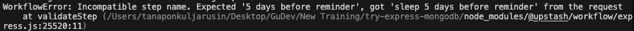

<h3 align="center">Subscription Tracker API</h3>

## ⚠️ Note

This project was implemented based on a tutorial video on YouTube from JS Mastery [Complete Backend Course | Build and Deploy Your First Production-Ready API](https://www.youtube.com/watch?v=rOpEN1JDaD0).

## Table of Contents

1. [Introduction](#introduction)
2. [Demo](#demo)
3. [Tech Stack](#tech-stack)
4. [Features](#features)
5. [Quick Start](#quick-start)
6. [What I learned](#learn)
7. [Implementation Notes](#note)
8. [Missing Features](#miss)

## <a name="introduction">Introduction</a>

Backend API for a subscription management service that sends email reminders to users every notice period before a subscription expires.
This backend also implements user registration, authentication with JWT, rate limiting, and bot protection.

The reason I wanted to follow this tutorial is that I want to try to learn more about Express.js and MongoDB.

## <a name="demo">Demo</a>

### Auth

#### Sign up


#### Sign in


### Users

#### Get users


#### Get user by id


### Subscriptions

#### Create subscription


#### Reminder email when subscription renewal date is close (7,5,2,1 `day` before renewal date)

Noted that i changed the code to send email by 7,5,2,1 `minute` before renewal date for testing purpose


Example email at 7 day before renewal date


Example email at 1 day before renewal date


#### Get subscriptions by user id


## <a name="tech-stack">Tech Stack</a>

- Express - as a backend framework

- MongoDB Atlas - as a cloud MongoDB database service(Free tier)

- Mongoose - as an Object Data Modeling (ODM) library for `MongoDB`. `ODM` is like `ORM`(Object Relational Mapping) but for `NoSQL database`, which is used to map the `Model`'s data structure in the database into an Object class in the application as in Object Oriented Programming (OOP) style. Allow you to call methods from that `Model` class to create, update, delete, and find data in the database without writing a raw query.

- Arcjet - as a middleware for rate limiting, protect from bots and also protect from attacks

- Workflow from Upstash - as a messaging and scheduling service with steps tracking feature. Allow you to create an endpoint containing a sequences of steps to execute. And between each steps, you can let it wait until specific time has been passed or specific event has been triggered before continue the code execution without blocking the server thread.

  - In this project, it will execute some steps after specific time has been passed to send email reminders to users.(7,5,2,1 day before subscription renewal date)

- NPM Libraries

  - bcryptjs - as a password hashing tool

    - When a user sign up, hash a password before saving it into the database
    - When a user sign in, verify the user's input password with the hashed password from the database

  - jsonwebtoken - as a JSON Web Token (JWT) tool

    - When a user sign in, create a JWT token
    - When a user accesses protected routes, verify the JWT token in the `request header`

  - nodemailer - as an email sending tool for sending email reminders (Use personal `gmail` as a sender)

  - validator - as a string validation tool for email (Actually, it provides various validation methods for string input, not just the email)

  - dayjs - as a date and time library for date comparison and formatting dates and times

  - cookie-parser - as a middleware for a cookie parsing tool. Added follow a tutorial video and does nothing in this project since we use a JWT token in the `Authorization` header.

    - But there are use cases in security when implement `frontend` side

      - Use `HTTP only cookie` to store JWT token instead of storing it in `localStorage` to prevent `XSS attack`

      - Set `SameSite` to `Strict` to prevent `CSRF attack`

  - nodemon - to restart the server automatically when a file is changed

## <a name="features">Features</a>

- Advanced Rate Limiting and Bot Protection: with Arcjet that helps you secure the whole app.

- Database Modeling: Models and relationships using MongoDB & Mongoose.

- JWT Authentication: User CRUD operations and subscription management.

- Global Error Handling: Input validation and middleware integration.

- Logging Mechanisms: For better debugging and monitoring.

- Email Reminders: Automating smart email reminders with workflows using Upstash.

## <a name="quick-start">Quick Start</a>

Follow these steps to set up the project locally on your machine.

### Prerequisites

- Git
- Node.js
- npm
- Select one of the following
  - `ngrok` or "any tunnelling solution" to expose local development server for api callback from workflow
  - `@upstash/qstash-cli` to run qstash on `local mode` ( They just added `monitoring feature` for `local mode` at the time I writing this README.md. I hope it happen sooner 😅. So local tunneling will not needed when i implementing this project)

### Cloning the Repository

```bash
git clone https://github.com/bank8426/try-express-mongodb.git
cd try-express-mongodb
```

### Installation

Install the project dependencies using npm:

```bash
npm install
```

### Set Up Environment Variables

1. Create a new file named `.env.development.local` and copy content inside `.env.example`
2. Replace the placeholder values with your actual credentials

```env
PORT=5500
# callback url for workflow after they create workflow_id
SERVER_URL="http://localhost:5500"
NODE_ENV=

# https://cloud.mongodb.com/
DB_URI=

# jwt secret key can be any string for learning purpose
JWT_SECRET=
# check https://www.npmjs.com/package/jsonwebtoken about expiresIn option
JWT_EXPIRES_IN='1d'

# https://app.arcjet.com/
ARCJET_KEY=
ARCJET_ENV=

# https://console.upstash.com/workflow/
# These will be different between running on local and on server
QSTASH_URL=http://127.0.0.1:8080
QSTASH_TOKEN=
QSTASH_CURRENT_SIGNING_KEY=
QSTASH_NEXT_SIGNING_KEY=

# gmail
EMAIL_USER=
# https://myaccount.google.com/u/1/apppasswords
EMAIL_PASSWORD=
```

### Option 1: running ngrok or any tunneling solution

1. Run your tunneling solution
   

2. Replace `SERVER_URL` with your `tunneling or forwarding url`
3. Get `QSTASH_URL`, `QSTASH_TOKEN`, `QSTASH_CURRENT_SIGNING_KEY`, `QSTASH_NEXT_SIGNING_KEY` from `https://console.upstash.com/workflow/` Quickstart section

### Option 2: running qstash on local mode

1. Click on `Local Mode` button
   
2. Run

   ```bash
   npx @upstash/qstash-cli@latest dev
   ```

   If it working, you will see `Connection Status` like this

   

3. Replace `QSTASH_URL` with `http://localhost:8080` in case you run it on port 8080
4. Get `QSTASH_TOKEN`, `QSTASH_CURRENT_SIGNING_KEY`, `QSTASH_NEXT_SIGNING_KEY` from your terminal or go to
   `https://console.upstash.com/workflow/` Quickstart section ( values will be changed when you run it on local mode )

**Running the Project**

```bash
npm run dev
```

Your server will run on [http://localhost:5500](http://localhost:5500/)

<!-- TODO -->

## <a name="learn">What I learned</a>

- `Express.js`

  - `app.use()` is used to mount a middleware function which can use for something like parsing request body, parsing cookie in request header, call 3rd party middleware and also `Router` when create nested routes
  - `app.get()/post()/put()/delete()` is used to handle HTTP request but it can add middleware function and chain it as well by adding it as parameter after route path and before last callback function.
    - Ex.
      ```js
      userRouter.get("/", authorize, getUsers);
      ```

- `Mongoose`

  - Also has `pre` and `post` middleware for your model's method call. `pre` is middleware that will run before method is called and `post` is middleware that will run after method is called.

    - Example: Before save new data into database, you can run some process before save new data into database.

    ```js
    subscriptionSchema.pre("save", function (next) {
      if (!this.renewalDate) {
        const renewalPeriods = {
          daily: 1,
          weekly: 7,
          monthly: 30,
          yearly: 365,
        };
        this.renewalDate = new Date(this.startDate);
        this.renewalDate.setDate(
          this.renewalDate.getDate() + renewalPeriods[this.frequency]
        );
      }
      // Auto update the status if renewal date has passed
      if (this.renewalDate < new Date()) {
        this.status = "expired";
      }
      next();
    });
    ```

- `arcjet` - there're many rate limiting algorithm that can be use. `Token bucket` is new to me. It use the idea that each request will consume a token. Each path that request called can cost different amount of tokens. Token will refill after a certain amount of time and has max amount of tokens that can be stored. If the token is not enough, request will be blocked.

- `bcryptjs`

  - can be used for creating salt that will mix with password before hash it to create hashed password that will be saved into database
  - can be used to verify hashed password with user input password with `bcrypt.compare` method which will run process to make hashed password from user input password and compare it with hashed password in database for us.

- `jsonwebtoken` can be used for creating and verifying JSON Web Tokens (JWT) similor to `jose` library. But this is easier to use.

- `dayjs` is a date and time library that can be used for date comparison and formatting dates and times. Ex. isBefore(), isAfter(), isSame() etc.

- `nodemailer` can be used for sending email by using your own gmail account for free. But also need to enable `2 step verification` in your gmail account and generate `app password` for it.

- `workflow` - this one take a while to understand how it works between server side and workflow side(props to ngrok since it log everytime when any endpoint has been called.) The idea is that on backend must have a callback endpoint to handle request from workflow side using `serve(async (context)=>{...})` function from `@upstash/workflow/express` instead of normal way to handle request like `async (req, res, next)=>{...}`. This `serve` will act as middleware to handle request from workflow side which include `context` that tracking steps of workflow and will use to replicate all previous steps and continue from where it left off. If somehow the replication result in different step than it should be, it will throw error. This can due to how your code handle business logic and result of each step. There is best practice and thing you should avoid to do from https://upstash.com/docs/workflow/basics/caveats. In my case, it because `Time-dependent` code.

  - From tutorial video, we will create condition based on `current time`.
    - `first condition` - If it not the time to remind yet, it will call `context.sleepUntil` to wait until the right time and continue the work flow again(which will continue down to below condition)
    - `second condition` - If it is the time to remind, it will call `context.run` to send reminder email.

It mean that,

1. In the `first run`, the `first condition` is `true`, So the step that run `context.sleepUntil` will excute and point at that `context.sleepUntil` as the lastest step in `context`.
2. In the `second run` after `context.sleepUntil`, when it try to replicate all steps based on `context`, due to the time passed, `first condition` will be `false`. And got `context.run` instead as the lastest step in `context`. which will conflict with the `first run` since it expect `context.sleepUntil` before continue the process. This will throw error. Like below image



From the start, based on create subscription and send reminder email flow

On `server` side, in create subscription API

1. Create and save new subscription into database (return with `subscriptionId`)
2. Trigger new workflow by using `workflowClient.trigger` method with their required information. In this case, there are 2 important information that need to provide which is `url` to our callback endpoint that will handle the request from workflow and `body` contains initial data for first step of workflow (in this case, `subscriptionId`).
3. If everything is correct, it will return with `workflowRunId`.

On `workflow` side, after `workflowRunId` is created

- It will call our callback endpoint with `context` which tracking current step of workflow and store result of previous step. In this case, `subscriptionId` since it in first step of workflow.

On `server` side, in callback endpoint (subscription/reminder) - ( initial step - `get subscription` )

1. Extract `subscriptionId` from `context.requestPayload`
2. call `fetchSubscription` function which will call `context.run` which has step name `get subscription` to get `subscription` data by `subscriptionId` from database
3. after `context.run`, it will send information from `return` back to workflow side and track that it already run `get subscription` step.

On workflow side, after `get subscription` step is run

1. Save result of `get subscription` step into `context`
2. Call our callback endpoint with new `context`

On `server` side, in callback endpoint (subscription/reminder) - (after`get subscription` - `sleep until 7 days before reminder`)

1. after `context.run` `get subscription` return
2. I save data in `subscription` variable
3. Check if `subscription` is `active` and `renewalDate` is not passed

call `triggerReminder` function which will call `context.run` to get `subscription` data by `subscriptionId` from database

1. Create `new workflow run` and call `callback url`(`${SERVER_URL}/subscription/reminder` endpoint) with `context` which has `workflowRunId`, `subscriptionId`(in `requestPayload`) and a lot of other information.
1. Server side(subscription/reminder endpoint) (need to use `serve` function from `@upstash/workflow/express` to handle request)
1. Extract `subscriptionId` from `context.requestPayload`
1. call `fetchSubscription` function which will call `context.run` to get `subscription` data by `subscriptionId` from database
1. Check if `subscription` is `active` and `renewalDate` is not passed
1. If `subscription` is `active` and `renewalDate` is not passed, it will call `sendReminderEmail` function to send email to user

in `subscription/reminder` endpoint

Each workflow

And each time context will change based on result of previous step.
Starting from our server side,

( ) Because on callback endpoint, you will only see logging continue without seeing that there is incoming request from workflow side between each step. Actually we can know if there is incoming request by add middleware to do the logging before continue the process in callback endpoint.

Let explain it with example

From the but each time it will run the code from where it left off from previous step or from the beginning of the code which tracking inside `context` object from workflow side.

## <a name="note">Implementation Notes</a>

- MongoDB Atlas - everytime your IP address changed, you need to add it to the whitelist in the cloud mongodb. By go to https://cloud.mongodb.com/ and click on `Network Access` in `Security` section -> `Add IP Address` -> `Add Current IP Address`. Actually you can allow all IP address by click on `Add IP Address` -> `Allow Access from Anywhere`

- Workflow

workflow callback
call everytime after workflow method is called

from https://upstash.com/docs/workflow/troubleshooting/general#authorization-error-handling
https://upstash.com/docs/workflow/basics/caveats

Problem: time-dependent code

also because of using sleepUntil which try to resume workflow from where it left off.

The recommended pattern to check the condition is to check it inside the Workflow method and return the result instead of checking the condition on the server side, then calling the Workflow method, which will make it confusing and throw an error like (`Incompatible step name. Expected <STEP_NAME>, got <STEP_NAME> since it is considered as `Updating).https://upstash.com/docs/workflow/howto/changes

- Workflow method

  - `stepName` in this project, we called it `label` since we also use it to check `email template label` when sending email - But since the purpose of `stepName` iso track current step of `workflow` and it must be `unique`. Then the problem happened

    - If you use the same label for different workflow methods( `run` and `sleepUntil` in this case), it will throw error.

    - If you use the same label with same workflow method, it will has some weird behavior. (from what i try)

  - `stepName` miss

  1. Server side(subscription/reminder endpoint) (need to use `serve` function from `@upstash/workflow/express` to handle request)
  <!-- TODO -->

## <a name="miss">Missing Features</a>

Auth

- Sign out ( By default, it's done on frontend by just removing token from cookie or localStorage. To do on backend might need to create new collection for blacklisted tokens)

Subscription

- Get all subscriptions
- Get subscription details by subscription id
- Update subscription
- Cancel subscription
- Delete subscription (May be soft delete)
- Get upcoming renewal

User

- Create user (No need since when user sign up, it will create user in database, maybe for invitation user case)
- Update user
- Delete user (May be soft delete)

Reminder Email

- All link in email is not implemented

```

```
